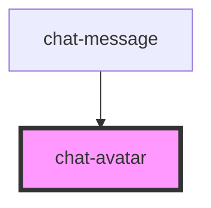

# chat-avatar


<!-- Auto Generated Below -->


## Usage

### Javascript

```html
<chat-avatar src="https://via.placeholder.com/250" />
```


## Properties

| Property | Attribute | Description                  | Type     | Default     |
| -------- | --------- | ---------------------------- | -------- | ----------- |
| `src`    | `src`     | The path to the avatar image | `string` | `undefined` |


## Dependencies

### Used by

 - [chat-message](..\chat-message)

### Graph


----------------------------------------------

*Built with [StencilJS](https://stenciljs.com/)*
