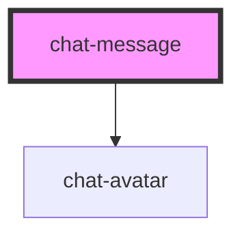

# chat-message

<!-- Auto Generated Below -->

## Properties

| Property   | Attribute  | Description                                        | Type     | Default     |
| ---------- | ---------- | -------------------------------------------------- | -------- | ----------- |
| `avatar`   | `avatar`   | The avatar url of the user who created the message | `string` | `undefined` |
| `datetime` | `datetime` | The timestamp of when the message was created      | `string` | `undefined` |
| `message`  | `message`  | The sent message                                   | `string` | `undefined` |
| `username` | `username` | The username of the user who created message       | `string` | `undefined` |

## Dependencies

### Depends on

- [chat-avatar](..\chat-avatar)

### Graph

----------------------------------------------

*Built with [StencilJS](https://stenciljs.com/)*
